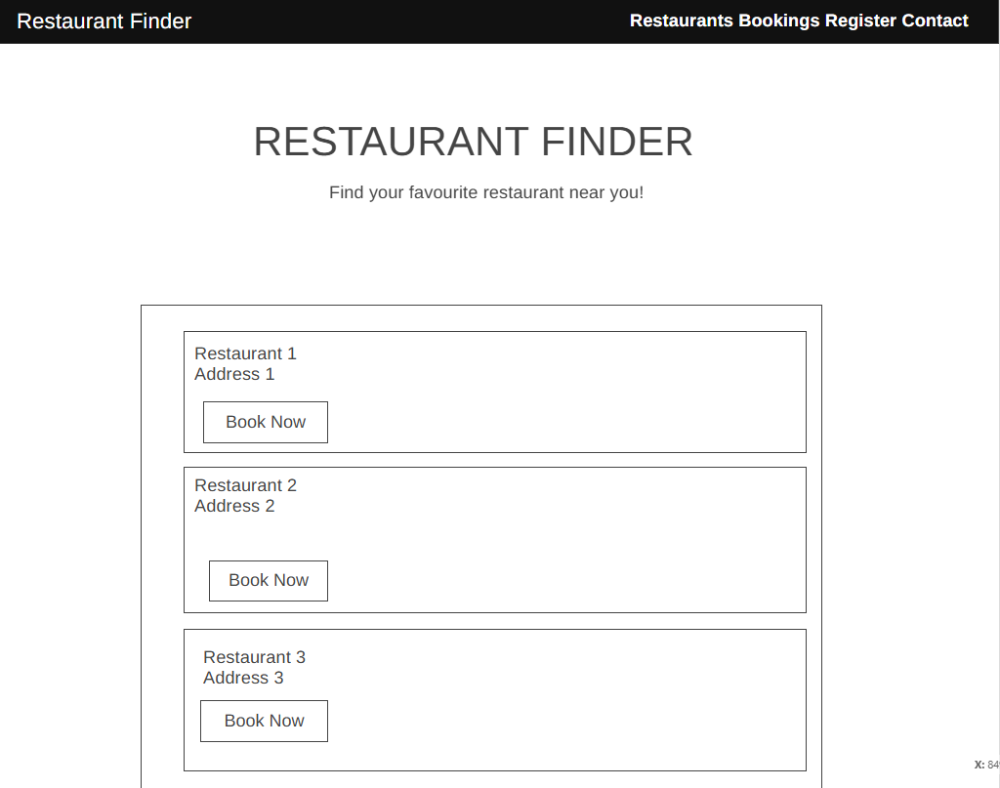
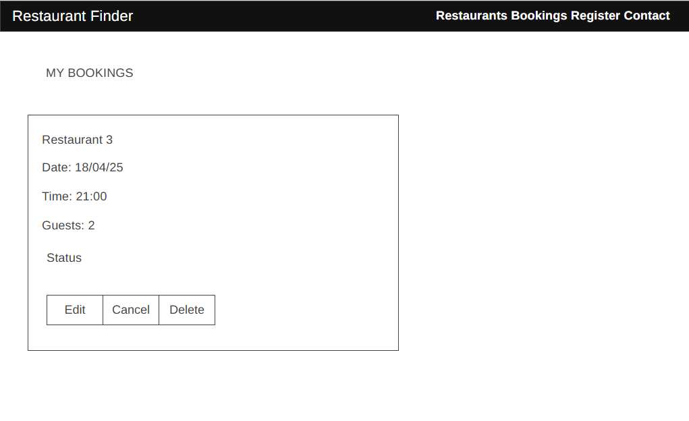

# Restaurant Finder

Restaurant Finder is a web application that allows users to browse restaurants, check time slots, and make bookings. Designed to simplify the reservation process, this app ensures users can conveniently plan their dining experience.

## Project Goals

The main objectives of this project are:
- To provide an easy-to-use restaurant booking system
- To help restaurants manage their bookings efficiently
- To improve the dining experience through organized reservations
- To demonstrate full-stack development capabilities using Django

## UX Design

### Design Philosophy
The Restaurant Finder application was designed with a user-centric approach, focusing on simplicity, accessibility, and efficiency. Our design decisions were guided by the following principles:

- **Intuitive Navigation**: Clear hierarchy and logical flow through the booking process
- **Responsive Design**: Seamless experience across all device sizes
- **Visual Clarity**: Clean layout with proper spacing and typography
- **Accessibility**: WCAG 2.1 compliance for inclusive user experience

### Color Scheme
- Primary: #4A90E2 (Blue) - Represents trust and professionalism
- Secondary: #50C878 (Emerald Green) - Indicates success and confirmation
- Accent: #FF6B6B (Coral) - Used for calls-to-action and important buttons
- Background: #F8F9FA (Light Gray) - Ensures readability and reduces eye strain
- Text: #333333 (Dark Gray) - Provides optimal contrast for readability

### Typography
- Headings: 'Playfair Display' - Elegant serif font for restaurant names and main headings
- Body: 'Open Sans' - Clean sans-serif font for optimal readability
- Special Text: 'Lato' - Used for prices and important information

### User Flow
1. Homepage Entry
   - Quick restaurant search
   - Featured restaurants display
   - Clear call-to-action for booking

2. Restaurant Selection
   - Grid view with essential information
   - Quick filters for cuisine and location
   - Clear availability indicators

3. Booking Process
   - Step-by-step form with progress indicator
   - Clear date and time selection
   - Guest number adjustment
   - Special requests section

4. Confirmation
   - Booking summary
   - Confirmation number
   - Add to calendar option

### Wireframes

#### Desktop Views

- Clean navigation bar
- Featured restaurants in grid layout


- Restaurant details 
- Clear call-to-action buttons

### User Stories to Design Mapping

1. First-time User Goals
   - Clear value proposition on homepage
   - Simple registration process
   - Guided booking experience

2. Returning User Goals
   - Quick access to bookings
   - Saved preferences
   - Streamlined booking process

3. Restaurant Owner Goals
   - Dashboard for managing bookings
   - Clear booking analytics
   - Easy menu management


### Accessibility Considerations
- ARIA labels for all interactive elements
- Sufficient color contrast (WCAG AA compliant)
- Keyboard navigation support
- Screen reader compatibility
- Responsive font sizes

## Technologies Used

- **Frontend**:
  - HTML5
  - CSS3
  - JavaScript
  - Bootstrap (for responsive design)

- **Backend**:
  - Python 3.8+
  - Django 5.1.5
  - django-allauth (for authentication)
  - PostgreSQL (via Neon)

- **Development Tools**:
  - Git & GitHub (Version Control)
  - GitHub Projects (Agile Project Management)
  - VSCode (Development Environment)
  - Heroku (Deployment Platform)

## Agile Development

This project was developed using Agile methodology, with work organized into the following sprints:

1. **Sprint 1: Initial Setup and Models**
   - Database design and implementation
   - Basic model creation
   - Initial project setup

2. **Sprint 2: Basic UI and Restaurant Management**
   - Restaurant listing functionality
   - Menu management system
   - Basic UI implementation

3. **Sprint 3: Authentication System**
   - User registration
   - Login/logout functionality
   - User role management

4. **Sprint 4: Booking System and Contact**
   - Booking creation and management
   - Contact form implementation
   - Email notifications

5. **Working Features**
   - Final testing and bug fixes
   - Performance optimization
   - Documentation completion

All sprints were tracked using GitHub Projects.

## How to Use

1. Visit the live application [here](https://restaurantbookingp4-c41e1049427c.herokuapp.com/).
2. Browse the available restaurants on the homepage.
3. View restaurant details such as location, opening hours, and contact information.
4. Check availability and time slots.
5. Make a booking by selecting a date, time, and specifying the number of guests.

## Features

### Existing Features:

1. **Restaurant Listings:**
   - Displays a list of restaurants with their names, addresses, opening hours, and contact details.

    

2. **Booking System:**
   - Users can reserve tables by selecting a restaurant, time slot, and specifying the number of guests.
   - Users can provide special requests during booking.

   

3. **Menu Display:**
   - Restaurants can showcase their menu items with descriptions and prices.

   

4. **User Accounts:**
   - Allow users to create accounts to view and manage their bookings.

   
   

### Future Features:

1. **Rating and Reviews:**
   - Enable users to rate restaurants and provide reviews after dining.

2. **Enhanced Search and Filters:**
   - Add advanced filters for cuisine, price range, and ratings.

3. **Email Notifications:**
   - Send users confirmation emails and reminders for their bookings.

## Testing

### Automated Testing
The project includes comprehensive test coverage for:
- Models (restaurant/tests.py)
- Views (restaurant/tests_views.py)
- Forms (restaurant/tests_forms.py)
- Authentication (restaurant/tests_auth.py)

To run the tests:
```bash
python manage.py test
```

### Manual Testing
Manual testing was performed for:
- Responsive design across different devices
- User journey testing
- Form validation
- Authentication flows
- Booking process

## Deployment

### Local Development
1. Clone the repository:
   ```bash
   git clone https://github.com/your-username/restaurant-booking.git
   ```

2. Install dependencies:
   ```bash
   pip install -r requirements.txt
   ```

3. Set up environment variables:
   - Create a `.env` file with:
     ```
     DATABASE_URL=your_database_url
     SECRET_KEY=your_secret_key
     DEBUG=True
     ```

4. Run migrations:
   ```bash
   python manage.py migrate
   ```

5. Start the development server:
   ```bash
   python manage.py runserver
   ```

### Heroku Deployment
1. Create a new Heroku app
2. Add PostgreSQL addon
3. Configure environment variables in Heroku settings
4. Connect GitHub repository
5. Deploy main branch

## Data Model
 
### Classes:
 
#### 1. `Restaurant`
Represents a restaurant in the system, including its essential details such as name, address, operating hours, and contact information.
 
**Fields:**
- `name` (CharField): The name of the restaurant.
- `address` (CharField): The address of the restaurant.
- `description` (TextField): An optional description of the restaurant.
- `opening_time` (TimeField): Default set to 09:00 AM.
- `closing_time` (TimeField): Default set to 10:00 PM.
- `capacity` (IntegerField): The maximum capacity of the restaurant. Default is 50.
- `contact_number` (CharField): The restaurant's contact phone number.
- `email` (EmailField): The restaurant's contact email address.

**Methods:**
- `__str__`: Returns the name of the restaurant.
 
---
 
#### 2. `TimeSlot`
Represents available time slots for booking at a restaurant.
 
**Fields:**
- `restaurant` (ForeignKey): The associated restaurant.
- `start_time` (TimeField): The start time of the slot.
- `end_time` (TimeField): The end time of the slot.
- `is_available` (BooleanField): Indicates if the time slot is currently available for booking.
 
**Methods:**
- `__str__`: Returns the restaurant name and the time range of the slot.
 
---
 
#### 3. `Booking`
Handles user reservations and associated details, such as the restaurant, table, and time slot.
 
**Fields:**
- `user` (ForeignKey): The user making the booking.
- `restaurant` (ForeignKey): The restaurant for the booking.
- `table` (ForeignKey): An optional field linking to a specific table.
- `time_slot` (ForeignKey): An optional field linking to a specific time slot.
- `date` (DateField): The date of the booking.
- `time` (TimeField): The specific time of the booking.
- `number_of_guests` (PositiveIntegerField): The number of guests in the booking.
- `special_requests` (TextField): Any special requests made by the user. Optional.
- `status` (CharField): Status of the booking (`pending`, `confirmed`, `cancelled`).
- `created_at` (DateTimeField): The timestamp when the booking was created.
- `updated_at` (DateTimeField): The timestamp when the booking was last updated.
 
**Methods:**
- `__str__`: Returns a string indicating the user, restaurant, date, and time of the booking.
 
**Meta:**
- Orders bookings by the most recent `date` and `time`.
 
---
 
#### 4. `MenuItem`
Represents a menu item offered by a restaurant.
 
**Fields:**
- `name` (CharField): The name of the menu item.
- `description` (TextField): A description of the menu item.
- `price` (DecimalField): The price of the menu item.
- `restaurant` (ForeignKey): The restaurant offering the menu item.
 
**Methods:**
- `__str__`: Returns the name and price of the menu item.

## Design

### Design Decisions

1. **User Interface**
   - Clean, minimalist design focusing on content
   - Responsive layout that works on all devices
   - Clear call-to-action buttons
   - Consistent color scheme and typography

2. **User Experience**
   - Intuitive navigation flow
   - Clear feedback for user actions
   - Easy-to-use booking process
   - Quick access to important information

3. **Technical Architecture**
   - Django-based backend for robust data handling
   - PostgreSQL database for reliable data storage
   - Django Admin interface for efficient management
   - RESTful API design for future scalability

4. **Security Considerations**
   - User authentication and authorization
   - Secure form handling
   - Data validation and sanitization
   - CSRF protection

5. **Performance Optimization**
   - Efficient database queries
   - Caching strategies
   - Optimized static file serving
   - Lazy loading of images

### Color Scheme
- Primary: #2C3E50 (Dark Blue)
- Secondary: #E74C3C (Red)
- Accent: #3498DB (Light Blue)
- Background: #F8F9FA (Light Gray)
- Text: #2C3E50 (Dark Blue)

### Typography
- Headings: 'Roboto', sans-serif
- Body: 'Open Sans', sans-serif
- Sizes:
  - H1: 2.5rem
  - H2: 2rem
  - H3: 1.75rem
  - Body: 1rem
  - Small: 0.875rem

## Credits

### Code
- Django documentation for authentication implementation
- Bootstrap documentation for responsive design
- Stack Overflow community for debugging assistance

### Media
- Restaurant images from [source]
- Icons from [source]

### Acknowledgements
- Code Institute for project requirements and guidance
- Fellow students for testing and feedback