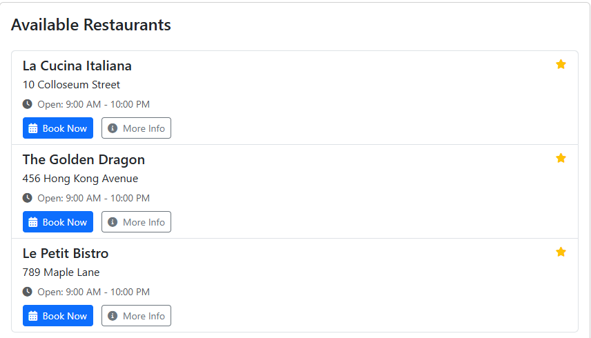
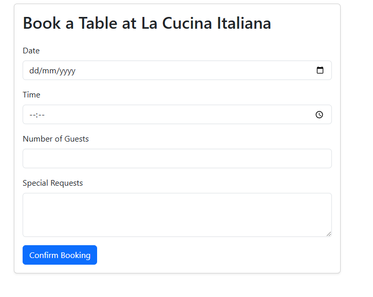
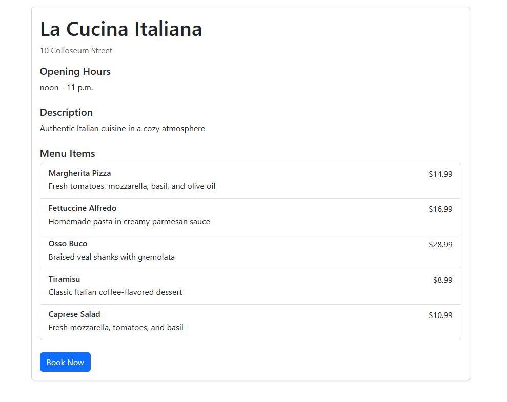
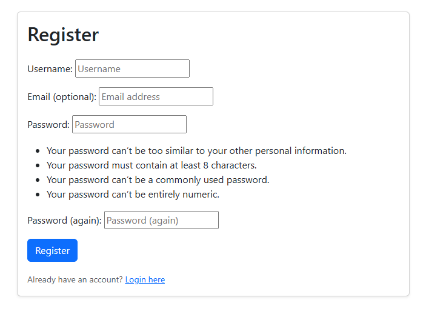
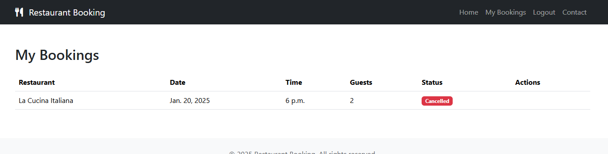

# Restaurant Finder

Restaurant Finder is a web application that allows users to browse restaurants, check time slots, and make bookings. Designed to simplify the reservation process, this app ensures users can conveniently plan their dining experience.

---

## How to Use

1. Visit the live application [here](https://restaurantbookingp4-3e3fd346ce64.herokuapp.com/).
2. Browse the available restaurants on the homepage.
3. View restaurant details such as location, opening hours, and contact information.
4. Check availability and time slots.
5. Make a booking by selecting a date, time, and specifying the number of guests.

---

## Features

### Existing Features:

1. **Restaurant Listings:**
   - Displays a list of restaurants with their names, addresses, opening hours, and contact details.

    

2. **Booking System:**
   - Users can reserve tables by selecting a restaurant, time slot, and specifying the number of guests.
   - Users can provide special requests during booking.

   

3. **Menu Display:**
   - Restaurants can showcase their menu items with descriptions and prices.

   

4. **User Accounts:**
   - Allow users to create accounts to view and manage their bookings.

   
   

### Future Features:

1. **Rating and Reviews:**
   - Enable users to rate restaurants and provide reviews after dining.

2. **Enhanced Search and Filters:**
   - Add advanced filters for cuisine, price range, and ratings.

3. **Email Notifications:**
   - Send users confirmation emails and reminders for their bookings.

---

## User Stories

### Authentication Stories
1. **User Registration**
   - As a new user
   - I want to create an account
   - So that I can access the booking system
   - Acceptance Criteria:
     - User can enter username, email, and password
     - System validates email format
     - System enforces password strength requirements
     - User receives confirmation message

2. **User Login**
   - As a registered user
   - I want to log in to my account
   - So that I can manage my bookings
   - Acceptance Criteria:
     - User can enter credentials
     - System validates credentials
     - User is redirected to dashboard after successful login
     - Failed login shows appropriate error message

### Restaurant Browsing Stories
1. **View Restaurant List**
   - As a user
   - I want to see a list of available restaurants
   - So that I can choose where to dine
   - Acceptance Criteria:
     - List shows restaurant names, addresses, and opening hours
     - Each restaurant has a "View Details" button
     - List is responsive and works on all devices

2. **View Restaurant Details**
   - As a user
   - I want to see detailed information about a restaurant
   - So that I can make an informed decision
   - Acceptance Criteria:
     - Shows full restaurant description
     - Displays opening hours and contact information
     - Shows available menu items
     - Includes "Book Now" button

### Booking Management Stories
1. **Create Booking**
   - As a logged-in user
   - I want to make a new booking
   - So that I can reserve a table
   - Acceptance Criteria:
     - User can select date and time
     - User can specify number of guests
     - User can add special requests
     - System validates availability
     - User receives booking confirmation

2. **Edit Booking**
   - As a logged-in user
   - I want to modify my existing booking
   - So that I can update my reservation details
   - Acceptance Criteria:
     - User can change date and time
     - User can update number of guests
     - User can modify special requests
     - System validates new availability
     - User receives update confirmation

3. **Cancel Booking**
   - As a logged-in user
   - I want to cancel my booking
   - So that I can free up the table for others
   - Acceptance Criteria:
     - User can cancel from booking details
     - System shows confirmation dialog
     - User receives cancellation confirmation
     - Table becomes available for new bookings

4. **Delete Booking**
   - As a logged-in user
   - I want to permanently remove my booking
   - So that I can clean up my booking history
   - Acceptance Criteria:
     - User can delete from booking details
     - System shows confirmation dialog
     - Booking is removed from history
     - User receives deletion confirmation

### Contact System Stories
1. **Submit Contact Form**
   - As a user
   - I want to send a message to the restaurant
   - So that I can ask questions or provide feedback
   - Acceptance Criteria:
     - User can enter name, email, and message
     - System validates email format
     - User receives submission confirmation
     - Admin receives notification

2. **View Contact History**
   - As an admin
   - I want to see all contact submissions
   - So that I can respond to user inquiries
   - Acceptance Criteria:
     - List shows all contact submissions
     - Each entry shows sender and timestamp
     - Admin can mark messages as read/unread
     - Admin can delete messages

### Admin Management Stories
1. **Approve/Reject Bookings**
   - As an admin
   - I want to manage booking requests
   - So that I can control restaurant capacity
   - Acceptance Criteria:
     - Admin can view pending bookings
     - Admin can approve or reject bookings
     - User receives status update notification
     - System updates booking status

2. **Manage Restaurant Details**
   - As an admin
   - I want to update restaurant information
   - So that I can keep details current
   - Acceptance Criteria:
     - Admin can edit restaurant details
     - Admin can update opening hours
     - Admin can manage menu items
     - Changes are immediately visible

---

## Data Model
 
 ### Classes:
 
 #### 1. `Restaurant`
 Represents a restaurant in the system, including its essential details such as name, address, operating hours, and contact information.
 
 **Fields:**
 - `name` (CharField): The name of the restaurant.
 - `address` (CharField): The address of the restaurant.
 - `description` (TextField): An optional description of the restaurant.
 - `opening_time` (TimeField): Default set to 09:00 AM.
 - `closing_time` (TimeField): Default set to 10:00 PM.
 - `capacity` (IntegerField): The maximum capacity of the restaurant. Default is 50.
 - `contact_number` (CharField): The restaurant's contact phone number.
 - `email` (EmailField): The restaurant's contact email address.
 
 **Methods:**
 - `__str__`: Returns the name of the restaurant.
 
 ---
 
 #### 2. `TimeSlot`
 Represents available time slots for booking at a restaurant.
 
 **Fields:**
 - `restaurant` (ForeignKey): The associated restaurant.
 - `start_time` (TimeField): The start time of the slot.
 - `end_time` (TimeField): The end time of the slot.
 - `is_available` (BooleanField): Indicates if the time slot is currently available for booking.
 
 **Methods:**
 - `__str__`: Returns the restaurant name and the time range of the slot.
 
 ---
 
 #### 3. `Booking`
 Handles user reservations and associated details, such as the restaurant, table, and time slot.
 
 **Fields:**
 - `user` (ForeignKey): The user making the booking.
 - `restaurant` (ForeignKey): The restaurant for the booking.
 - `table` (ForeignKey): An optional field linking to a specific table.
 - `time_slot` (ForeignKey): An optional field linking to a specific time slot.
 - `date` (DateField): The date of the booking.
 - `time` (TimeField): The specific time of the booking.
 - `number_of_guests` (PositiveIntegerField): The number of guests in the booking.
 - `special_requests` (TextField): Any special requests made by the user. Optional.
 - `status` (CharField): Status of the booking (`pending`, `confirmed`, `cancelled`).
 - `created_at` (DateTimeField): The timestamp when the booking was created.
 - `updated_at` (DateTimeField): The timestamp when the booking was last updated.
 
 **Methods:**
 - `__str__`: Returns a string indicating the user, restaurant, date, and time of the booking.
 
 **Meta:**
 - Orders bookings by the most recent `date` and `time`.
 
 ---
 
 #### 4. `MenuItem`
 Represents a menu item offered by a restaurant.
 
 **Fields:**
 - `name` (CharField): The name of the menu item.
 - `description` (TextField): A brief description of the dish.
 - `price` (DecimalField): The price of the menu item.
 - `restaurant` (ForeignKey): The associated restaurant offering this menu item.
 
 **Methods:**
 - `__str__`: Returns the name and price of the menu item.
 
 ---
 
 ## Testing
 
 ### Test Cases:
 
 | Test Category            | Test Case                                                       | Expected Result                                                       | Pass/Fail |
 |--------------------------|----------------------------------------------------------------|------------------------------------------------------------------------|-----------|
 | **Functional Tests**     | User can create an account                                     | Account is created, and user is redirected to the login page          | Pass      |
 |                          | User can log in                                               | User is logged in and redirected to the dashboard                     | Pass      |
 |                          | User can view restaurant details                              | Restaurant details page displays correct information                  | Pass      |
 |                          | User can book a table                                         | Booking is saved, and confirmation is shown                          | Pass      |
 |                          | User can view their bookings                                  | Bookings are listed on the "My Bookings" page                        | Pass      |
 | **Edge Cases**           | Booking a full time slot                                      | Error message displayed, booking is not created                      | Pass      |
 |                          | Canceling a booking                                           | Booking is removed from the system                                   | Pass      |
 |                          | Invalid login credentials                                     | Error message is shown, login is prevented                           | Pass      |
 
 ---
 
 ## UX Design
 
 This section outlines the key design considerations that aim to provide a positive user experience for the Restaurant Finder application.
 
 **1. Clear Navigation**
    *   **Header Navigation:** The header contains navigation links for "Restaurants", "Login", "Register", and "Contact". These links are clearly visible and provide straightforward navigation to essential areas of the application.
    *   **Consistent Placement:** The navigation bar is consistently placed at the top of the page, which aids in predictability and helps the user easily understand how to move through the application.
 
 **2. Restaurant Listing**
 
    *   **Clear Structure:** The restaurant list is presented in an organized, card-like format. Each restaurant's information is distinctly separated for easy viewing, including the Restaurant Name, Address, and opening hours.
    *   **Actionable Buttons:** Each restaurant card contains "Book Now" and "More Info" buttons. These provide clear calls to action and are easy to identify, facilitating easy engagement and task completion.
    *   **Welcome Message:**  A welcome message is present above the restaurant listing which provides clear instructions as to the purpose of the application.
 
 **3. Responsive Layout**
 
    *   The interface is responsive to different device sizes. The use of card-like scale nicely across a wide range of screen sizes.
 
 **4. Visual Hierarchy**
 
    *   **Headings:** Heading sizes and styles are well-defined to clearly indicate the title of the page or section.
    *   **Text:** The text is of an appropriate size and contrast to ensure it is easily read.
 
 **Further UX Considerations (Future Enhancements)**
 
    *   **Search Functionality:** Adding a search bar would allow users to quickly find specific restaurants.
    *   **Filtering and Sorting:** Features to filter restaurants by cuisine, price, or rating, and sort by distance or popularity could further improve the experience.
    *   **User Feedback:** Integrating a rating system for restaurants would give users a way to communicate their experience.
    *  **Loading states:** Handling loading states can improve the user experience by providing feedback to the user that the website is working on a specific request.
    * **Error states:** Designing for error states can improve the user experience by clearly communicating to the user that something went wrong and how to resolve it.
 
 This UX design prioritizes ease of use and quick access to information, making it simple for users to find and book a restaurant. Future enhancements will build upon this foundation, making for an excellent user experience.
 This UX design prioritizes ease of use and quick access to information, making it simple for users to find and book a restaurant. Future enhancements will build upon this foundation, making for an excellent user experience.
 
 ---
 
 ## Bugs
 
 ### Solved Bugs
 1. **Import Statements:** Fixed an issue with incorrect import statements being used causing page to not load.
 2. **Registration Form:** Addressed issue with register form working with trusted origins issue where path register was failing due to a trailing "/".
 3. **Allauth issue:** Resolved issue where allauth was stopping styles from being applied to log in and register page.
 
 ### Remaining Bugs
 - There are currently no remaining bugs.
 
 ---
 
 ## Deployment
 
 The following steps were taken to deploy the application:
 
 1. Create a new Heroku App.
 2. Link the Heroku App to the repository.
 3. Deploy the app via Heroku.
 
 ---
 
 ## Credits
 
 1. **Code Institute:** Provided the foundational structure and project setup inspiration.
 2. **W3 Schools & Django Documentation:** For guidance on model development and validation.
 3. **Heroku:** For deployment resources and tutorials.
 
 ---
