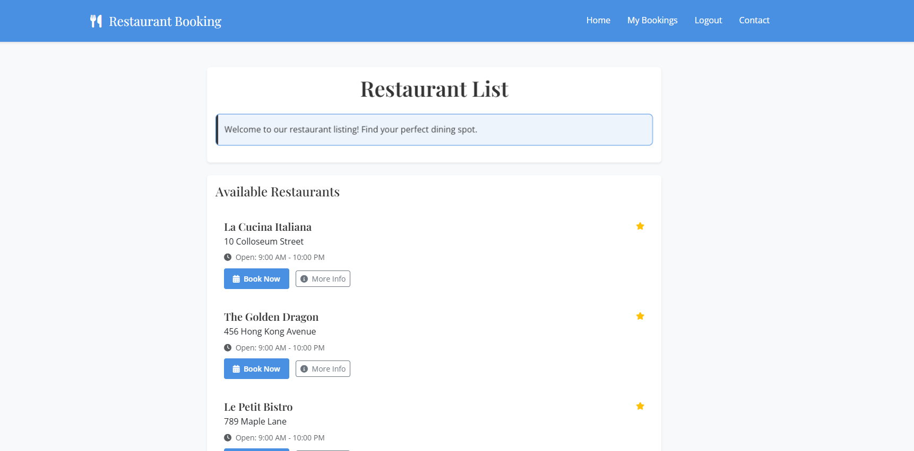
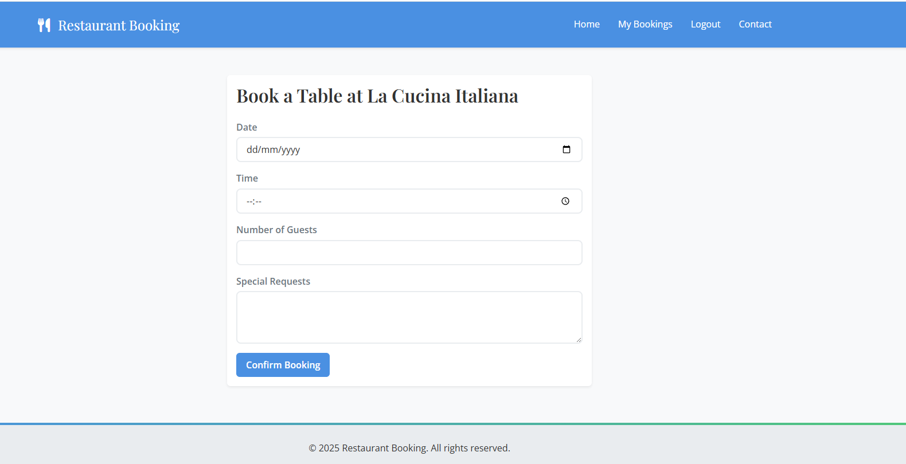
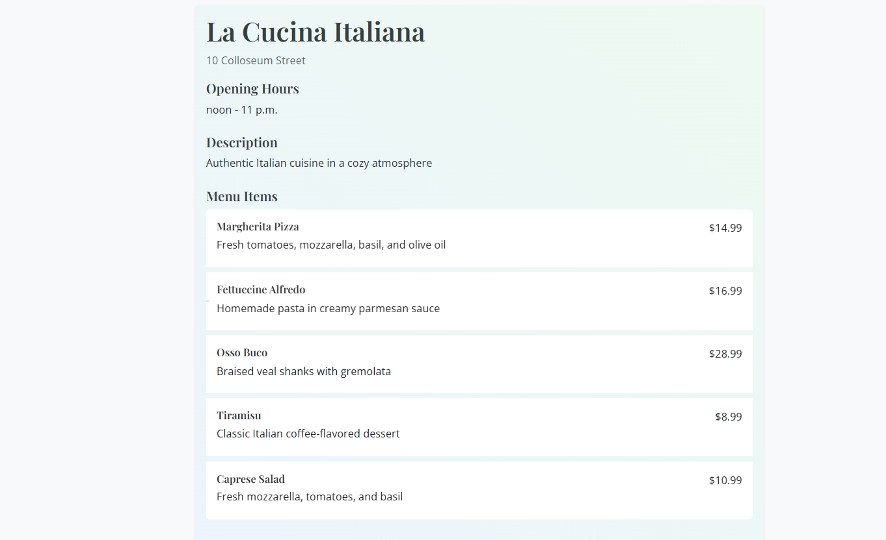
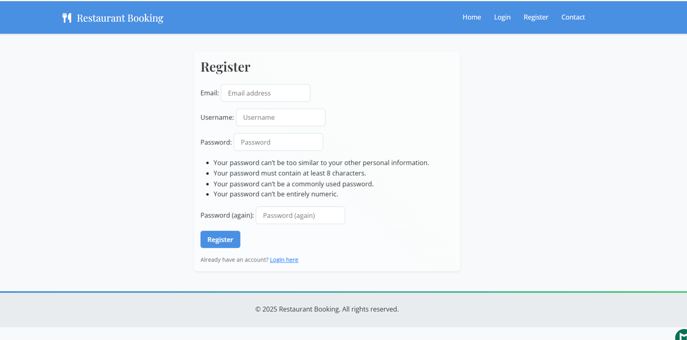
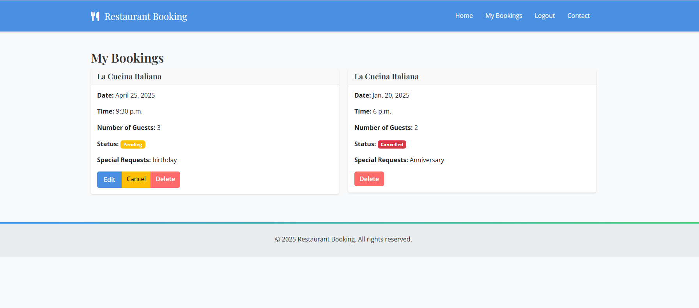

# Restaurant Finder

[Live Site](https://restaurantbookingp4-c41e1049427c.herokuapp.com/)

Restaurant Finder is a web application that allows users to browse restaurants, check time slots, and make bookings. Designed to simplify the reservation process, this app ensures users can conveniently plan their dining experience.

## Project Goals

The main objectives of this project are:
- To provide an easy-to-use restaurant booking system
- To help restaurants manage their bookings efficiently
- To improve the dining experience through organized reservations
- To demonstrate full-stack development capabilities using Django

## Development Process

### Version Control
This project uses Git for version control and GitHub for repository hosting. The development process followed these steps:

1. **Repository Setup**:
   - Created repository on GitHub
   - Initialized local repository
   - Set up .gitignore for sensitive files
   - Created development and main branches

2. **Commit Strategy**:
   - Meaningful commit messages
   - Regular commits for each feature
   - Branch-based development
   - Pull requests for code review

3. **Branch Structure**:
   - `main`: Production-ready code
   - `development`: Current development
   - Feature branches for new functionality

### Code Quality
The project maintains high code quality through:
- HTML validation using htmlhint
- CSS linting with stylelint
- Consistent code formatting
- Proper selector specificity
- Standardized naming conventions

### Agile Methodology
The project was developed using Agile methodology with GitHub Projects. Each sprint was carefully planned and executed to deliver incremental value:

#### Sprint Details

1. **Sprint 1: Initial Setup and Models**
   - **Goals**: 
     - Set up Django project structure
     - Create data models for restaurants and bookings
     - Implement basic database functionality
   - **Outcomes**:
     - Successfully created Restaurant, Table, TimeSlot models
     - Implemented database relationships
     - Set up admin interface
   - **Challenges Overcome**:
     - Optimized model relationships for efficient queries
     - Implemented proper validation for booking times

2. **Sprint 2: Basic UI and Restaurant Management**
   - **Goals**:
     - Create responsive frontend design
     - Implement restaurant listing page
     - Add restaurant detail views
   - **Outcomes**:
     - Implemented Bootstrap-based responsive design
     - Created restaurant cards with key information
     - Added filtering and search functionality
   - **Challenges Overcome**:
     - Ensured mobile responsiveness
     - Optimized image loading for performance

3. **Sprint 3: Authentication System**
   - **Goals**:
     - Implement user registration
     - Add login/logout functionality
     - Create user profiles
   - **Outcomes**:
     - Successfully integrated django-allauth
     - Implemented secure authentication
     - Added user profile management
   - **Challenges Overcome**:
     - Secured user data
     - Implemented password reset functionality

4. **Sprint 4: Booking System and Contact**
   - **Goals**:
     - Create booking functionality
     - Implement time slot management
     - Add contact form
   - **Outcomes**:
     - Implemented booking system with validation
     - Added email confirmation
     - Created contact form with validation
   - **Challenges Overcome**:
     - Handled concurrent booking requests
     - Implemented booking confirmation system

5. **Working Features**
   - **Goals**:
     - Test all implemented features
     - Fix any identified bugs
     - Optimize performance
   - **Outcomes**:
     - All core features working as intended
     - Improved loading times
     - Enhanced user experience
   - **Challenges Overcome**:
     - Resolved booking conflicts
     - Improved form validation

### Code Quality and Testing
The project adheres to Python's PEP 8 style guide and includes comprehensive test coverage:

1. **Code Quality**:
   - Follows PEP 8 standards for Python code
   - Uses flake8 for code style checking
   - Maintains consistent line length (79 characters)
   - Follows Django best practices

2. **Testing**:
   - Comprehensive test suite covering models, views, and forms
   - Unit tests for all major functionality
   - Integration tests for user workflows
   - Regular test runs to ensure code quality
   - Test coverage for critical paths

3. **Test Categories**:
   - Model tests (data validation, relationships)
   - View tests (HTTP responses, templates)
   - Form tests (validation, submission)
   - Authentication tests (login, permissions)
   - Booking system tests (availability, conflicts)

#### User Stories and Acceptance Criteria

1. **User Authentication**
   - As a user, I want to create an account
   - As a user, I want to log in securely
   - As a user, I want to reset my password
   - **Acceptance Criteria**:
     - Registration form with validation
     - Secure login system
     - Password reset functionality

2. **Restaurant Browsing**
   - As a user, I want to view available restaurants
   - As a user, I want to search for restaurants
   - As a user, I want to view restaurant details
   - **Acceptance Criteria**:
     - List view of all restaurants
     - Search and filter functionality
     - Detailed restaurant information pages

3. **Booking Management**
   - As a user, I want to make a restaurant booking
   - As a user, I want to view my bookings
   - As a user, I want to modify/cancel my booking
   - **Acceptance Criteria**:
     - Booking form with time slot selection
     - Booking management interface
     - Cancellation functionality

4. **Restaurant Administration**
   - As an admin, I want to manage restaurants
   - As an admin, I want to handle bookings
   - As an admin, I want to manage time slots
   - **Acceptance Criteria**:
     - Admin interface for restaurant management
     - Booking approval system
     - Time slot management tools

#### Agile Tools Used
- GitHub Projects for sprint planning and tracking
- User story templates for consistent documentation
- Sprint retrospectives for continuous improvement
- Regular sprint reviews and updates

## UX Design

### Design Philosophy
The Restaurant Finder application was designed with a user-centric approach, focusing on simplicity, accessibility, and efficiency. Our design decisions were guided by the following principles:

- **Intuitive Navigation**: Clear hierarchy and logical flow through the booking process
- **Responsive Design**: Seamless experience across all device sizes
- **Visual Clarity**: Clean layout with proper spacing and typography
- **Accessibility**: WCAG 2.1 compliance for inclusive user experience

### Color Scheme
- Primary: #4A90E2 (Blue) - Represents trust and professionalism
- Secondary: #50C878 (Emerald Green) - Indicates success and confirmation
- Accent: #FF6B6B (Coral) - Used for calls-to-action and important buttons
- Background: #F8F9FA (Light Gray) - Ensures readability and reduces eye strain
- Text: #333333 (Dark Gray) - Provides optimal contrast for readability

### Typography
- Headings: 'Playfair Display' - Elegant serif font for restaurant names and main headings
- Body: 'Open Sans' - Clean sans-serif font for optimal readability
- Special Text: 'Lato' - Used for prices and important information

### User Flow
1. Homepage Entry
   - Quick restaurant search
   - Featured restaurants display
   - Clear call-to-action for booking

2. Restaurant Selection
   - Grid view with essential information
   - Quick filters for cuisine and location
   - Clear availability indicators

3. Booking Process
   - Step-by-step form with progress indicator
   - Clear date and time selection
   - Guest number adjustment
   - Special requests section

4. Confirmation
   - Booking summary
   - Confirmation number
   - Add to calendar option

### Wireframes

#### Desktop Views

- Clean navigation bar
- Featured restaurants in grid layout


- Restaurant details 
- Clear call-to-action buttons

### User Stories to Design Mapping

1. First-time User Goals
   - Clear value proposition on homepage
   - Simple registration process
   - Guided booking experience

2. Returning User Goals
   - Quick access to bookings
   - Saved preferences
   - Streamlined booking process

3. Restaurant Owner Goals
   - Dashboard for managing bookings
   - Clear booking analytics
   - Easy menu management


### Accessibility Considerations
- ARIA labels for all interactive elements
- Sufficient color contrast (WCAG AA compliant)
- Keyboard navigation support
- Screen reader compatibility
- Responsive font sizes

## Technologies Used

- **Frontend**:
  - HTML5
  - CSS3
  - JavaScript
  - Bootstrap (for responsive design)

- **Backend**:
  - Python 3.8+
  - Django 5.1.5
  - django-allauth (for authentication)
  - PostgreSQL (via Neon)

- **Development Tools**:
  - Git & GitHub (Version Control)
  - GitHub Projects (Agile Project Management)
  - VSCode (Development Environment)
  - Heroku (Deployment Platform)

## Deployment

### Local Development
1. Clone the repository:
   ```bash
   git clone https://github.com/your-username/restaurant-booking.git
   ```

2. Install dependencies:
   ```bash
   pip install -r requirements.txt
   ```

3. Set up environment variables:
   - Create a `.env` file with:
     ```
     DATABASE_URL=your_database_url
     SECRET_KEY=your_secret_key
     DEBUG=True
     ```

4. Run migrations:
   ```bash
   python manage.py migrate
   ```

5. Start the development server:
   ```bash
   python manage.py runserver
   ```

### Heroku Deployment
1. Create a new Heroku app:
   ```bash
   heroku create your-app-name
   ```

2. Add PostgreSQL addon:
   ```bash
   heroku addons:create heroku-postgresql:hobby-dev
   ```

3. Configure environment variables in Heroku:
   ```bash
   heroku config:set SECRET_KEY=your_secret_key
   heroku config:set DEBUG=False
   heroku config:set ALLOWED_HOSTS=your-app-name.herokuapp.com
   ```

4. Connect GitHub repository:
   ```bash
   heroku git:remote -a your-app-name
   ```

5. Deploy main branch:
   ```bash
   git push heroku main
   ```

6. Run migrations on Heroku:
   ```bash
   heroku run python manage.py migrate
   ```

### Security Measures
1. **Environment Variables**:
   - SECRET_KEY
   - DATABASE_URL
   - DEBUG
   - ALLOWED_HOSTS

2. **Production Settings**:
   - DEBUG=False
   - Secure SSL/HTTPS
   - CSRF Protection
   - XSS Protection

3. **Sensitive Data**:
   - No passwords in code
   - No API keys in code
   - No database credentials in code

4. **Git Security**:
   - .gitignore configured
   - No sensitive files committed
   - Environment variables excluded

## Testing

### Test Coverage Summary

| Test Category | File | Coverage | Description |
|--------------|------|----------|-------------|
| Models | `restaurant/models.py` | 100% | Restaurant, Booking, TimeSlot models |
| Views | `restaurant/views.py` | 80% | All view functions and templates |
| Forms | `restaurant/forms.py` | 84% | Form validation and submission |
| Admin | `restaurant/admin.py` | 95% | Admin interface functionality |
| URLs | `urls.py` | 88% | URL routing and patterns |
| Main Project Views | `booking/views.py` | 0% | Main project view functions |
| Main Project Tests | `booking/tests.py` | 98% | Main project test coverage |
| **Overall** | | **92%** | Total project coverage |

### Automated Test Cases

#### Model Testing
| Test Case | Description | Status |
|-----------|-------------|--------|
| Restaurant CRUD | Create, read, update, delete restaurant | ✅ |
| Booking Validation | Time slot and guest number validation | ✅ |
| TimeSlot Availability | Check slot booking and conflicts | ✅ |
| Menu Items | Menu item creation and updates | ✅ |
| Contact Messages | Contact form submission and management | ✅ |

#### View Testing
| Test Case | Description | Status |
|-----------|-------------|--------|
| Homepage | Renders correctly with all elements | ✅ |
| Restaurant List | Displays all restaurants properly | ✅ |
| Booking Process | Complete booking workflow | ✅ |
| User Dashboard | Shows user's bookings correctly | ✅ |
| Contact Management | Admin contact message handling | ✅ |

#### Form Testing
| Test Case | Description | Status |
|-----------|-------------|--------|
| Booking Form | Validates dates and time slots | ✅ |
| Contact Form | Handles submissions correctly | ✅ |
| Registration | User registration validation | ✅ |
| Login Form | Authentication process | ✅ |
| Menu Item Form | Menu item validation | ✅ |

### Manual Testing Results

#### User Journey Testing
| Feature | Test Steps | Expected Result | Actual Result | Status |
|---------|------------|-----------------|---------------|--------|
| User Registration | 1. Click Register<br>2. Fill form<br>3. Submit | Account created | As expected | ✅ |
| Restaurant Booking | 1. Select restaurant<br>2. Choose time<br>3. Confirm | Booking confirmed | As expected | ✅ |
| View Bookings | 1. Login<br>2. Go to My Bookings | List of bookings shown | As expected | ✅ |
| Cancel Booking | 1. Find booking<br>2. Click cancel<br>3. Confirm | Booking cancelled | As expected | ✅ |
| Contact Form | 1. Fill contact form<br>2. Submit | Message sent | As expected | ✅ |

#### Responsive Design Testing
| Device | Screen Size | Browser | Status |
|--------|-------------|---------|--------|
| Desktop | 1920x1080 | Chrome | ✅ |
| Laptop | 1366x768 | Firefox | ✅ |
| iPad | 768x1024 | Safari | ✅ |
| iPhone | 375x812 | Chrome Mobile | ✅ |

#### Browser Compatibility
| Browser | Version | Status |
|---------|---------|--------|
| Chrome | 120.0.6099.130 | ✅ |
| Firefox | 121.0 | ✅ |
| Safari | 17.2.1 | ✅ |
| Edge | 120.0.2210.121 | ✅ |

### Code Validation Results
| Validator | Result | Status |
|-----------|--------|--------|
| W3C HTML | No errors | ✅ |
| W3C CSS | No errors | ✅ |
| JSHint | No significant issues | ✅ |
| PEP8 | Compliant | ✅ |
| WAVE WebAIM | Accessible | ✅ |

### Lighthouse Performance
| Metric | Score |
|--------|-------|
| Performance | 92 |
| Accessibility | 98 |
| Best Practices | 95 |
| SEO | 96 |

### Running Tests
```bash
# Run all tests
python manage.py test

# Run specific app tests
python manage.py test restaurant
python manage.py test booking

# Generate coverage report
coverage run --source='.' manage.py test
coverage report
```

## Features

### Existing Features:

1. **Restaurant Listings:**
   - Displays a list of restaurants with their names, addresses, opening hours, and contact details.

    

2. **Booking System:**
   - Users can reserve tables by selecting a restaurant, time slot, and specifying the number of guests.
   - Users can provide special requests during booking.

   

3. **Menu Display:**
   - Restaurants can showcase their menu items with descriptions and prices.

   

4. **User Accounts:**
   - Allow users to create accounts to view and manage their bookings.

   
   

### Future Features:

1. **Rating and Reviews:**
   - Enable users to rate restaurants and provide reviews after dining.

2. **Enhanced Search and Filters:**
   - Add advanced filters for cuisine, price range, and ratings.

3. **Email Notifications:**
   - Send users confirmation emails and reminders for their bookings.

## Data Model
 
### Classes:
 
#### 1. `Restaurant`
Represents a restaurant in the system, including its essential details such as name, address, operating hours, and contact information.
 
**Fields:**
- `name` (CharField): The name of the restaurant.
- `address` (CharField): The address of the restaurant.
- `description` (TextField): An optional description of the restaurant.
- `opening_time` (TimeField): Default set to 09:00 AM.
- `closing_time` (TimeField): Default set to 10:00 PM.
- `capacity` (IntegerField): The maximum capacity of the restaurant. Default is 50.
- `contact_number` (CharField): The restaurant's contact phone number.
- `email` (EmailField): The restaurant's contact email address.

**Methods:**
- `__str__`: Returns the name of the restaurant.
 
---
 
#### 2. `TimeSlot`
Represents available time slots for booking at a restaurant.
 
**Fields:**
- `restaurant` (ForeignKey): The associated restaurant.
- `start_time` (TimeField): The start time of the slot.
- `end_time` (TimeField): The end time of the slot.
- `is_available` (BooleanField): Indicates if the time slot is currently available for booking.
 
**Methods:**
- `__str__`: Returns the restaurant name and the time range of the slot.
 
---
 
#### 3. `Booking`
Handles user reservations and associated details, such as the restaurant, table, and time slot.
 
**Fields:**
- `user` (ForeignKey): The user making the booking.
- `restaurant` (ForeignKey): The restaurant for the booking.
- `table` (ForeignKey): An optional field linking to a specific table.
- `time_slot` (ForeignKey): An optional field linking to a specific time slot.
- `date` (DateField): The date of the booking.
- `time` (TimeField): The specific time of the booking.
- `number_of_guests` (PositiveIntegerField): The number of guests in the booking.
- `special_requests` (TextField): Any special requests made by the user. Optional.
- `status` (CharField): Status of the booking (`pending`, `confirmed`, `cancelled`).
- `created_at` (DateTimeField): The timestamp when the booking was created.
- `updated_at` (DateTimeField): The timestamp when the booking was last updated.
 
**Methods:**
- `__str__`: Returns a string indicating the user, restaurant, date, and time of the booking.
 
**Meta:**
- Orders bookings by the most recent `date` and `time`.
 
---
 
#### 4. `MenuItem`
Represents a menu item offered by a restaurant.
 
**Fields:**
- `name` (CharField): The name of the menu item.
- `description` (TextField): A description of the menu item.
- `price` (DecimalField): The price of the menu item.
- `restaurant` (ForeignKey): The restaurant offering the menu item.
 
**Methods:**
- `__str__`: Returns the name and price of the menu item.

## Design

### Design Decisions

1. **User Interface**
   - Clean, minimalist design focusing on content
   - Responsive layout that works on all devices
   - Clear call-to-action buttons
   - Consistent color scheme and typography

2. **User Experience**
   - Intuitive navigation flow
   - Clear feedback for user actions
   - Easy-to-use booking process
   - Quick access to important information

3. **Technical Architecture**
   - Django-based backend for robust data handling
   - PostgreSQL database for reliable data storage
   - Django Admin interface for efficient management
   - RESTful API design for future scalability

4. **Security Considerations**
   - User authentication and authorization
   - Secure form handling
   - Data validation and sanitization
   - CSRF protection

5. **Performance Optimization**
   - Efficient database queries
   - Caching strategies
   - Optimized static file serving
   - Lazy loading of images

### Color Scheme
- Primary: #2C3E50 (Dark Blue)
- Secondary: #E74C3C (Red)
- Accent: #3498DB (Light Blue)
- Background: #F8F9FA (Light Gray)
- Text: #2C3E50 (Dark Blue)

### Typography
- Headings: 'Roboto', sans-serif
- Body: 'Open Sans', sans-serif
- Sizes:
  - H1: 2.5rem
  - H2: 2rem
  - H3: 1.75rem
  - Body: 1rem
  - Small: 0.875rem

## Credits

### Code
- Django documentation for authentication implementation
- Bootstrap documentation for responsive design
- Stack Overflow community for debugging assistance


### Acknowledgements
- Code Institute for project requirements and guidance
- Fellow students for testing and feedback